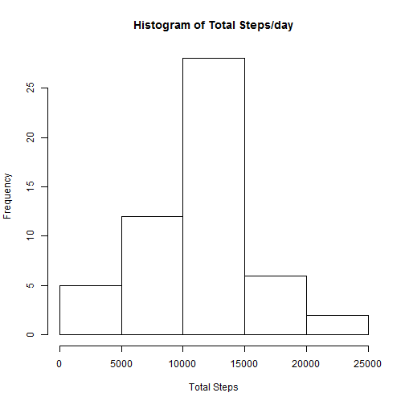
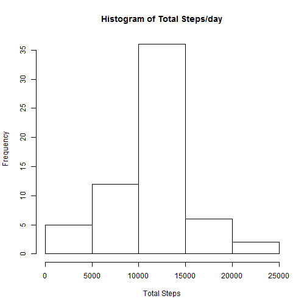
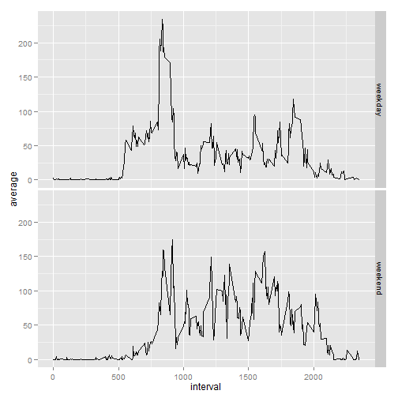

## Loading and preprocessing the data

```r
## Load libs
library(dplyr)
library(ggplot2)

# 1. Load the data
# 2. Process/transform the data (if necessary) into a format suitable for your analysis
## Unzip the data
unzip(zipfile = "activity.zip")
## Load the data and convert the date to a proper date format
data <- 
    read.csv(file = "activity.csv", header = TRUE, na.strings = "NA") %>%
    mutate(date = as.Date(date, format = "%Y-%m-%d"))
```


## What is mean total number of steps taken per day?

```r
# 1. Make a histogram of the total number of steps taken each day
## summarize data
dataSummarised <-    
    data %>%
    filter(!is.na(steps)) %>%
    group_by(date) %>%
    summarise(total = sum(steps))
## build histogram
hist(dataSummarised$total, xlab = "Total Steps", main = "Histogram of Total Steps/day")
```

 

```r
# 2. Calculate and report the mean and median total number of steps taken per day
## mean of total
mean(dataSummarised$total)
```

```
## [1] 10766.19
```

```r
## median of total
median(dataSummarised$total)
```

```
## [1] 10765
```

## What is the average daily activity pattern?

```r
# 1. Make a time series plot (i.e. type = "l") of the 5-minute interval (x-axis) 
#    and the average number of steps taken, averaged across all days (y-axis)
## summarize data
dataSummarised2 <-
    data %>%
    filter(!is.na(steps)) %>%
    group_by(interval) %>%
    summarise(average = mean(steps))
## build time series
plot(
    x = dataSummarised2$interval, 
    y = dataSummarised2$average, 
    type = "l", 
    xlab = "interval", ylab = "average")
```

 

```r
# 2. Which 5-minute interval, on average across all the days in the dataset, 
#    contains the maximum number of steps?
## get the interval with the maximum
dataSummarised2$interval[dataSummarised2$average == max(dataSummarised2$average)]
```

```
## [1] 835
```

## Imputing missing values

```r
# 1. Calculate and report the total number of missing values in the dataset 
#   (i.e. the total number of rows with NAs)
## calculate number of NA values
sum(is.na(data))
```

```
## [1] 2304
```

```r
# 2. Devise a strategy for filling in all of the missing values in the dataset. 
#    The strategy does not need to be sophisticated. 
## I am substituting the NA values by the mean of the steps taken for that particular interval. 
## I chose this strategy because people are likely to follow different patterns for different intervals 
## and therefore the number of steps is likely to differ a lot from interval to interval.

# 3. Create a new dataset that is equal to the original dataset but with the missing data filled in.
intervalMean <- 
    data %>%  
    filter(!is.na(steps)) %>%
    group_by(interval) %>%
    summarise(average = mean(steps))
    

dataSummarised3 <- 
    data %>%
    merge(intervalMean, by.x = "interval", by.y = "interval") %>%
    mutate(steps = ifelse(is.na(steps), average, steps), average = NULL)

# 4. Make a histogram of the total number of steps taken each day and Calculate and report the mean and 
#    median total number of steps taken per day. Do these values differ from the estimates from the first 
#    part of the assignment? What is the impact of imputing missing data on the estimates of the total 
#    daily number of steps?
## summarize data
dataSummarised3 <-    
    dataSummarised3 %>%
    group_by(date) %>%
    summarise(total = sum(steps))
## build histogram with substituted NA values
hist(dataSummarised3$total, xlab = "Total Steps", main = "Histogram of Total Steps/day")
```

 

```r
## mean of total
mean(dataSummarised3$total)
```

```
## [1] 10766.19
```

```r
## median of total
median(dataSummarised3$total)
```

```
## [1] 10766.19
```

```r
## The values differ because we are adding a few more values and occurrences the mean whereas before
## we just ignored those values.
## Even though the mean is the same (because the inserted values were in themselves a mean) but the 
## median changed slightly.
## Of course the total of steps also changed because the NA values now have a number that contributes 
## to the total whereas before they didn't.
```

## Are there differences in activity patterns between weekdays and weekends?

```r
# 1. Create a new factor variable in the dataset with two levels – “weekday” and “weekend” indicating 
#    whether a given date is a weekday or weekend day.
## Create a data frame with a weekday name to type map
weekdays <- 
    data.frame(
        c("Monday", "Tuesday", "Wednesday", "Thursday", "Friday", "Saturday", "Sunday"),
        c("weekday", "weekday", "weekday", "weekday", "weekday", "weekend", "weekend")    
    )
names(weekdays) <- c("weekday", "type")

## merge with the weekdays conversion and summarize the data
dataSummarised4 <-
    data %>%
    filter(!is.na(steps)) %>%
    mutate(weekday = weekdays(date)) %>%
    merge(weekdays) %>%
    mutate(daytype = as.factor(type), type = NULL, weekday = NULL) %>%
    group_by(interval, daytype) %>%
    summarise(average = mean(steps))

# 2. Make a panel plot containing a time series plot (i.e. type = "l") of the 5-minute interval (x-axis) 
#    and the average number of steps taken, averaged across all weekday days or weekend days (y-axis). 
#    See the README file in the GitHub repository to see an example of what this plot should look 
#    like using simulated data.
print(
    qplot(interval, average, data = dataSummarised4, facets = daytype~., geom = "line"))
```

 
